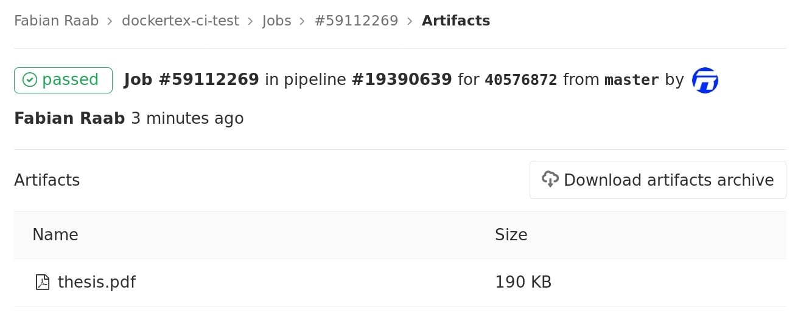

🐋📓 DockerTeX ➕ 🐋📽 DockerTeXstudio
=====================================

 
 
[](https://gitlab.com/raabf/dockertex/blob/master/LICENSE) 


#### 🏬 Dockerhub:

| 📓[raabf/latex-versions](https://hub.docker.com/r/raabf/latex-versions) | 📱[raabf/latex-versions-arm](https://hub.docker.com/r/raabf/latex-versions-arm)🆕 | 📽[raabf/texstudio-versions](https://hub.docker.com/r/raabf/texstudio-versions)|
|---------------|---------------|---------------|
|   |   |   |

Both images are automatically rebuilt on Dockerhub when the Debian or Ubuntu base images change (they do on average each once per month).

## 📑️ Table of Contents
<!-- MarkdownTOC -->

+ [🏆 Features](#-features)
+ [🏷 Supported tags](#-supported-tags)
+ [🖱 Usage](#-usage)
  - [📓 dockertex](#-dockertex)
  - [📽 dockertexstudio](#-dockertexstudio)
+ [🛠 Installation](#-installation)
  - [👔 zsh plugin manager](#-zsh-plugin-manager)
    * [zplug](#zplug)
  - [⛓ Automated script](#-automated-script)
  - [🔨 Manual](#-manual)
+ [🎈 Continuous Integration \(CI\)](#-continuous-integration-ci)
  - [GitLab CI](#gitlab-ci)
+ [💡 Contributing](#-contributing)

<!-- /MarkdownTOC -->

## 🏆 Features

  + 💯 The only latex docker which provides different texlive versions — all from 2012–2018!
  + 🐧 Uses Linux Debian and Ubuntu as backend.
  + 🏙 Complete latex package (texlive-full), which includes every latex module you normally need.
  + 📽 [TeXstudio](https://www.texstudio.org/)  GUI can be started in all containers.
  + 🏭 Common tools used with latex are pre-installed: biber, make, gnuplot, inkscape, pandoc, python-pygments.
  + ⬛ Easy and short shell commands to build your document in the docker container (see “Usage” section).
  + 🎎 Preserves your ownership (user and group ID) of all your files which get pushed or created by the docker container.
  + 👷 Easy installation via script or shell plugin-manager.
  + 🗃 Menu entries for TeXstudio of all installed texlive versions.
  + 🖥 The TexStudio GUI runs directly on your local X-server via shared sockets (no ssh X-forwarding or something like that).
  + 📍 The TexStudio’s “Go to PDF” and ‘’Go to Source Code” are working as well as the [LanguageTool](https://languagetool.org/) integration.
  + 🦫 Supports also [Podman](https://podman.io/) instead of docker CLI.


## 🏷 Supported tags

To specify your texlive version you can either use the texlive tag (texlive2012, texlive2013, …) or use the distribution codenames (wheezy, trusty, …)

| 📓texlive | 🏷docker-tag | 📀distro | 🏷docker-tag | 🐳Dockerfile and info for 📓Latex, 📱Latex-ARM,and 📽TeXstudio     | 📋Notes                                |
|----------:|:------------|--------:|:------------|:-----------------|:--------------------------------------|
|    v2012 | texlive2012 |  Debian | wheezy      | [](https://gitlab.com/raabf/dockertex/blob/master/latex/debian-wheezy.Dockerfile "Latex Dockerfile") [](https://gitlab.com/raabf/dockertex/blob/master/texstudio/debian-wheezy.Dockerfile "TeXstudio Dockerfile") | EOL²; last TeXstudio¹: 2.12.10-2         |
|    v2013 | texlive2013 |  Ubuntu | trusty      | [](https://gitlab.com/raabf/dockertex/blob/master/latex/ubuntu-trusty.Dockerfile "Latex Dockerfile") [](https://gitlab.com/raabf/dockertex/blob/master/texstudio/ubuntu-trusty.Dockerfile "TeXstudio Dockerfile") | EOL²                                     |
|    v2014 | texlive2014 armhf-texlive2014        |  Debian | jessie armhf-jessie               | [](https://gitlab.com/raabf/dockertex/blob/master/latex/ge-jessie.Dockerfile "Latex Dockerfile") [](https://gitlab.com/raabf/dockertex/blob/master/texstudio/debian-jessie.Dockerfile "TeXstudio Dockerfile") |                                       |
|    v2015 | texlive2015 armhf-texlive2015 arm64-texlive2015 |  Ubuntu | xenial armhf-xenial arm64-xenial     | [](https://gitlab.com/raabf/dockertex/blob/master/latex/ge-jessie.Dockerfile "Latex Dockerfile")  [](https://gitlab.com/raabf/dockertex/blob/master/texstudio/ubuntu-xenial.Dockerfile "TeXstudio Dockerfile") |                                       |
|    v2016 | texlive2016 armhf-texlive2016 arm64-texlive2016 |  Debian | stretch armhf-stretch arm64-stretch   | [](https://gitlab.com/raabf/dockertex/blob/master/latex/ge-jessie.Dockerfile "Latex Dockerfile") [](https://gitlab.com/raabf/dockertex/blob/master/texstudio/debian-stretch.Dockerfile "TeXstudio Dockerfile") | [](https://microbadger.com/images/raabf/latex-versions:latest) [](https://microbadger.com/images/raabf/latex-versions-arm:armhf-latest) [](https://microbadger.com/images/raabf/latex-versions-arm:arm64-latest) |
|    v2017 | texlive2017 armhf-texlive2017 arm64-texlive2017 |  Ubuntu | bionic armhf-bionic arm64-bionic     | [](https://gitlab.com/raabf/dockertex/blob/master/latex/ge-jessie.Dockerfile "Latex Dockerfile") [](https://gitlab.com/raabf/dockertex/blob/master/texstudio/debian-bionic.Dockerfile "TeXstudio Dockerfile") | no texstudio³ |
|    v2018 | texlive2018 armhf-texlive2018 arm64-texlive2018 |  Debian | buster armhf-buster arm64-buster     | [](https://gitlab.com/raabf/dockertex/blob/master/latex/ge-jessie.Dockerfile "Latex Dockerfile") [](https://gitlab.com/raabf/dockertex/blob/master/texstudio/debian-buster.Dockerfile "TeXstudio Dockerfile") | no texstudio³ [](https://microbadger.com/images/raabf/latex-versions:testing) |
|    v2019 | texlive2019 armhf-texlive2019 arm64-texlive2019 |  Ubuntu | focal armhf-focal arm64-focal     | [](https://gitlab.com/raabf/dockertex/blob/master/latex/ge-jessie.Dockerfile "Latex Dockerfile") [](https://gitlab.com/raabf/dockertex/blob/master/texstudio/debian-focal.Dockerfile "TeXstudio Dockerfile") | no texstudio³ |
|    v2020 | texlive2020 armhf-texlive2020 arm64-texlive2020 |  Debian | sid armhf-sid arm64-sid | [](https://gitlab.com/raabf/dockertex/blob/master/latex/ge-jessie.Dockerfile "Latex Dockerfile") [](https://gitlab.com/raabf/dockertex/blob/master/texstudio/debian-sid.Dockerfile "TeXstudio Dockerfile") | in development; no texstudio³ |

¹ TeXstudio does not provide builds for this Linux distribution version any more. The container is build with the last available TeXstudio version.

² The distribution release reached End Of Life, so there aren’t any updates any more. However, the docker image should still work.

³ The X-server sharing seems to not work any more for ubuntu bionic or later. I do no found any info nor a solution for that; see [issue #1](https://gitlab.com/raabf/dockertex/issues/1). Hence the latest tag keeps at stretch until it is working again, even if bionic is the latest stable distribution. Tell me your experience or if you have some new information on that.


## 🖱 Usage

Either [docker CLI](https://docs.docker.com/engine/reference/run/) or [Podman](https://podman.io/) are required to run the container.
You can either use the dockertexstudio images or – if you never need TeXstudio – just the dockertex images. The dockertexstudio images include all features of the dockertex images.  `dockertex` will automatically use the dockertexstudio images when installed on the local system, so that not twice as much disk space is occupied on your computer. 
 `dockertex` and `dockertexstudio`  will promt you to pull the docker images when necessary.

**Fonts** The images contain debian’s non-free repository and ubuntu’s multiverse. Beside the default latex fonts, Liberation and MSCoreFonts are installed. Liberation are a free replacement for the MSCoreFonts. If you still use the MSCoreFonts you accept their [EULA](http://corefonts.sourceforge.net/eula.htm).


### 📓 dockertex

Let's assume you are in a direcory with your latex file called `document.tex`, then for example just run:

    dockertex --tag texlive2016 pdftex document.tex


The general syntax is:

    dockertex [-t|--tag tagname] command


`dockertex` run the docker container with the tag `tagname` and mounts the current working directory `pwd` as a volume and just executes `command` in this mount point. Furthermore, the script makes sure that all files (changed and newly generated files) preserve their ownership (user and group ID) of the user executing `dockertex`.

`command` can be arbitrary and is not limit to tex commands, for example if you use a `Makefile`:

    dockertex --tag jessie make all


**Default Tag** To set a default Tag so that `--tag` is optional, set the environment variable:

    export DOCKERTEX_DEFAULT_TAG="texlive2016"

**Engine** To run the container, select an executable within your PATH. It defaults to `podman` when it is installed, else `docker`. Specify it with:

    export DOCKERTEX_ENGINE="podman"
    export DOCKERTEX_ENGINE="docker"

### 📽 dockertexstudio

`dockertexstudio` is a tool to start [TexStudio](https://www.texstudio.org/)  GUI inside a specified docker container. The usage of the tag is the same as `dockertex`:

     dockertexstudio [-t|--tag tagname] [-v|--volume mapping]* [texstudio options]


`dockertexstudio` always mounts your home directory `~` as volume in the container. If you need additional mount points, use `--volume`, which has the same syntax as in `docker run`. For example:

    dockertexstudio --tag texlive2016  --volume /media/git/:/home/git/


The configuration of TexStudio in the containers and among the containers is preserved between runs of the docker containers. Execute `dockertexstudio --help` to display the local path of the configuration folder.

**Menu Entries**  The menu entries generated during the Installation process will also make use of `dockertexstudio`. In your file manager, you can even open `.tex` files directly with TexStudio inside the container. Just assign `.tex` files to the appropriate menu entry. But be careful, direct opening only works if the full file path inside and outside the container, is the same — this is the case for the per default mounted home directory.

**Go to** Because TeXstudio is running inside the docker container, the “Go to PDF” and ‘’Go to Source Code”  functions via synctex are working.

**LanguageTool** [LanguageTool](https://languagetool.org/) is an advanced tool for grammar checking. It can be accessed via its HTTP API. `dockertexstudio` shares its network interface with the host system, so you can lunch LanguageTool on your host’s localhost interface (which is the default configuration for LanguageTool, so just start it normally) and `dockertexstudio` will be able to access it.


## 🛠 Installation

### 👔 zsh plugin manager

The most comfortable method to install it, is with a zsh plugin-manager. This approach has the big advantage that dockertex CLI will be updated together with your other plugins. 

The script `/posthook.sh` can install a menu entry into your desktop environment. The mandatory option `--menu-tag` allows to specify a docker tag for the menu entry. For mounting additional volumes, use the `--menu-volume` option—the syntax is the same as in `docker run`, except that you have to replace `:` with `=` because zplug does not allow a `:` in a string. Use `./posthook.sh …; ./posthook.sh …` multiple times for installing multiple menu entries for different tags.

Please consult the built-in help if you want to find out what the default installation paths are or to change those.

    curl https://gitlab.com/raabf/dockertex/raw/master/posthook.sh | bash -s -- --help


To install dockertex CLI, just add the repository to your plugin configuration  in your `~/.zshrc`. If you want to create a menu entries for TeXstudio, add `./posthook.sh` to the hook-build. For example your configuration could look like:


#### zplug

    zplug raabf/dockertex, \                                                                                                                                                    
        from:gitlab, \                                                                                                                                                          
        hook-build:"./posthook.sh --menu-tag latest --menu-volume /media/ext/=/home/ext/"


It should work also with any other plugin manager. If you have tested it with other plugin managers and if you want to extend this list please tell me at the [issues board](https://gitlab.com/raabf/dockertex/issues).


### ⛓ Automated script

If you do not have zsh, you can install the dockertex CLI and the TeXstudio menu entries through an install script. 

The mandatory option `--menu-tag` allows to install a menu entry into your desktop environment. For mounting additional volumes, use the `--menu-volume` option—the syntax is the same as in `docker run`. Just execute the script multiple times if want to have multiple menu entries with different tags.

Just run `install.sh` with:

    curl https://gitlab.com/raabf/dockertex/raw/master/install.sh | bash -s -- --menu-tag latest --menu-volume "/media/ext/:/home/ext/"


or to install it system wide

    curl https://gitlab.com/raabf/dockertex/raw/master/install.sh | bash -s -- --system --menu-tag latest --menu-volume /media/ext/:/home/ext/"


Just leave out the `--menu-tag` and `--menu-volume` options if you do not want to create any menu entry.

If you neither want to install the texstudio script nor the menu entries, use the `--no-texstudio` option.

    curl https://gitlab.com/raabf/dockertex/raw/master/install.sh | bash -s -- --no-texstudio


Please consult the built-in help if you want to find out what the default installation paths are or to change those.

    curl https://gitlab.com/raabf/dockertex/raw/master/install.sh | bash -s -- --help


### 🔨 Manual

Copy the scripts from `bin/` to a folder in your `PATH` such as `/usr/local/bin/`: 

    sudo cp bin/dockertex.sh /usr/local/bin/dockertex; sudo cp bin/dockertexstudio.sh /usr/local/bin/dockertexstudio


Make sure that the files have the executable bit set

    chmod a+x /usr/local/bin/dockertex*


Copy TeXstudio icon to an arbitrary place: 

    cp misc/icons/hicolor/scalable/apps/texstudio.svg /usr/local/share/icons/hicolor/scalable/apps/texstudio.svg


 Use the template `misc/dockertexstudio.desktop` to create one or multiple menu entry:

    cp misc/dockertexstudio.desktop /usr/local/share/applications/dockertexstudio-stretch.desktop 


Then append the missing fields:

    echo "Name=Docker TexStudio (stretch)                                                                                                                  
    Exec=/usr/local/bin/dockertexstudio --tag latest %F                      
    Icon=/usr/local/share/icons/hicolor/scalable/apps/texstudio.svg" >> /usr/local/share/applications/dockertexstudio-stretch.desktop


## 🎈 Continuous Integration (CI)

The latex images are working well for automatically build your output PDF in a Continuous Integration (CI) system.

### GitLab CI

First you have to register a [runner](https://docs.gitlab.com/runner/) at one of your servers with installed docker.  The only important thing is that you choose `docker` as executor. The given image is just a default docker image which can be overwritten later in the project config.

    sudo gitlab-runner register --url https://gitlab.com/ --executor "docker" --tag-list "docker, latex, dockertex" --docker-image "raabf/latex-versions:latest"

Then add the CI configuration file `.gitlab-ci.yml` to your git root. Use the following one as a template:

```yaml
stages:
  - latex

before_script:
  - lsb_release --all
  - latex --version

make_texlive2016:
  image: raabf/latex-versions:texlive2016
  stage: latex
  tags:
    - docker
  script:
    - make all
  artifacts:
    paths:
    - ./thesis.pdf
    expire_in: 1 week


# test your latex file on multiple versions

make_texlive2017:
  image: raabf/latex-versions:texlive2017
  stage: latex
  tags:
    - docker
  script:
    - make all
  artifacts:
    paths:
    - ./thesis.pdf
    expire_in: 1 week

make_texlive2015:
  image: raabf/latex-versions:texlive2015
  stage: latex
  tags:
    - docker
  script:
    - make all
  artifacts:
    paths:
    - ./thesis.pdf
    expire_in: 1 week
```

In this example `thesis.pdf` is your output. The artifact section will upload the specified file at the CI’s Web-Interface and make it even available for viewing and downloading!




Did you test it with other CI systems and want to extend this list of examples? Please tell me at the [issues board](https://gitlab.com/raabf/dockertex/issues).


## 💡 Contributing

This project aims to be a generalized latex environment for the majority of latex projects.
If something is missing or not working, then I’m happy for any contribution. You can find the [repository](https://gitlab.com/raabf/dockertex/) and [issues board](https://gitlab.com/raabf/dockertex/issues) at GitLab.
